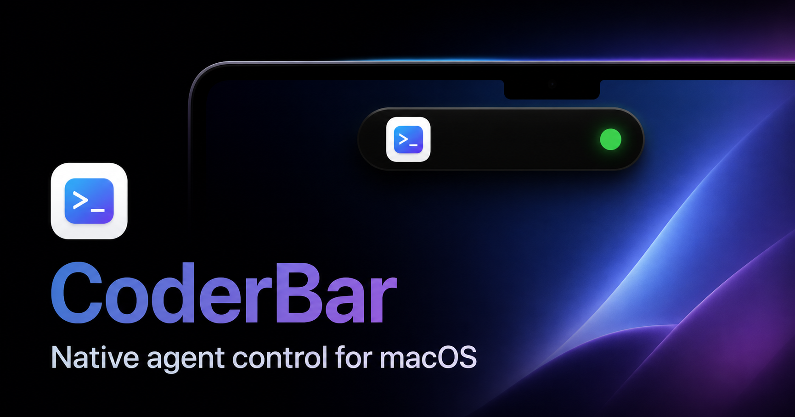
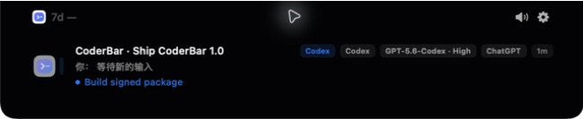
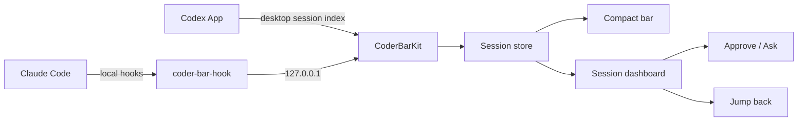

<p align="center">
  
</p>

<h1 align="center">CoderBar</h1>

<p align="center">
  <strong>Native agent control for macOS.</strong><br>
  Monitor Codex and Claude, make decisions, and jump back to work from the top of your screen.
</p>

<p align="center">
  
  
  
  
</p>

## The agent bar for your Mac

CoderBar is a native SwiftUI utility that attaches to the top edge of macOS. It discovers live desktop agent sessions and turns them into a compact control surface: quiet while agents work, detailed when something needs your attention.

<p align="center">
  
</p>

<p align="center">
  
</p>

## Four actions, one surface

| | Action | What it does |
|---|---|---|
| ◫ | **Monitor** | See active sessions, model, reasoning effort, usage, tasks, and sub-agents. |
| ✓ | **Approve** | Review permission requests and plans, then approve or reject them. |
| ? | **Ask** | Answer agent questions and choose options without switching apps. |
| ↗ | **Jump** | Return to the exact Codex, Claude, terminal, or tmux session. |

## Product capabilities

- **Real desktop sessions** — reads the session indexes owned by Codex App, Claude Code, and Claude Desktop.
- **Live agent state** — distinguishes working, waiting, completed, failed, and input-required states.
- **Decision UI** — supports approvals, plan reviews, multi-option questions, and text responses.
- **Task awareness** — shows active plan progress and hides completed plans when no work remains.
- **Sub-agent visibility** — surfaces child agent roles, models, tools, and completion state.
- **Usage windows** — displays available Codex rate-limit windows in the top bar.
- **Precise jump-back** — activates a deep link, terminal session, or tmux pane when a row is selected.
- **Multi-display placement** — pin CoderBar to the main display, focused display, or a selected screen.
- **Direction-aware hover** — opens only when the pointer enters from below the bar.
- **Native motion** — uses a top-attached AppKit panel with SwiftUI content and reduced-motion support.
- **Local notifications and sound** — optional completion, approval, and question alerts.
- **Configurable appearance** — panel size, content density, visible fields, behavior, and audio controls.

## How it works



CoderBar uses two complementary sources:

1. Desktop session discovery provides the authoritative list of sessions already known to agent apps.
2. Local hooks provide low-latency lifecycle, tool, approval, question, and sub-agent events.

The app listens only on the loopback interface and stores its state locally.

## Install

### Build from source

```bash
./Scripts/build.sh
./Scripts/package.sh
open dist/CoderBar.app
dist/bin/coder-bar-ctl configure
```

The configuration command adds CoderBar alongside existing agent hooks and creates `.coderbar.bak` backups before changing supported configuration files.

### Useful commands

```bash
dist/bin/coder-bar-ctl status
dist/bin/coder-bar-ctl discover
dist/bin/coder-bar-ctl deconfigure
```

## Requirements

- macOS 14 or newer
- Apple silicon Mac
- Swift 5.10 or newer for source builds
- Codex App, Claude Code, or Claude Desktop for live sessions

## Local data and privacy

CoderBar does not require an account or hosted transcript service.

| Data | Location |
|---|---|
| Hook executable, preferences, replies, debug logs | `~/.coderbar/` |
| Session event history | `~/Library/Application Support/CoderBar/events.jsonl` |
| Launch-at-login definition | `~/Library/LaunchAgents/dev.coderbar.agent.plist` |
| Agent config backups | `*.coderbar.bak` beside each changed config |

Errors are logged instead of being silently ignored. Debug builds can enable `CODERBAR_DEBUG` to record panel geometry and hover decisions.

## Project layout

```text
Sources/CoderBarKit/      Session discovery, event server, store, hooks, activation
Sources/coder-bar/       SwiftUI and AppKit macOS application
Sources/coder-bar-hook/  Agent hook forwarder
Sources/coder-bar-ctl/   Configure, remove, inspect, and discover commands
Scripts/                 Build, package, install, uninstall, and app icon tooling
website/                 CoderBar product website
docs/images/             Product and social-preview artwork
```

## Development

```bash
swift build
./Scripts/build.sh
open dist/CoderBar.app
```

The app exposes opt-in debug environment variables for deterministic UI checks:

- `CODERBAR_DEBUG_AUTO_EXPAND`
- `CODERBAR_DEBUG_AUTO_COLLAPSE`
- `CODERBAR_DEBUG_DISABLE_AUTO_COLLAPSE`
- `CODERBAR_DEBUG_DISABLE_DESKTOP_DISCOVERY`

## Product website

Visit the [CoderBar product website](https://coderbar-macos.jason09121.chatgpt.site). Its source lives in [`website/`](website/) and includes the complete product narrative, feature showcase, privacy story, download flow, responsive layouts, and social preview metadata.

---

<p align="center">Built for developers who want their agents nearby — not in the way.</p>
